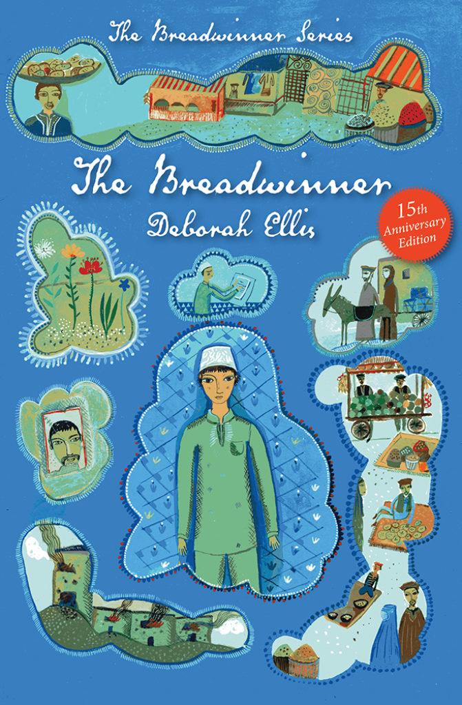

I love reading, and I’ve been enjoying quite a few amazing books/series for the past few months! 

<em>The Hunger Games<em> by Suzanne Collins.

I have been hearing about this series since I started middle school! Finally, my friend on SV Wippy told me she was reading the first book and I leapt at the chance to read a legendary trilogy. 

Blurb (spoiler alert!): <em>Katniss Everdeen lives in District 12, in the ruins of North America. She ends up in the 74th Hunger Games facing a battle to the death and impossible decisions. Love or life? Friendship or survival? Allies or enemies?<em> 

<em>The Breadwinner<em> by Deborah Ellis

Most kids have required reading books. Many kids drag their feet and grumble and groan when their parents bring out their book for the week. Thank goodness I’m not ‘most kids’! Being an eager beaver-who also doesn’t have anything to read digitally right now-I decided to close my eyes and run my fingers over the bookshelf of required reading. When I felt a spine that seemed interesting in my mind, I grabbed it. 

I highly recommend this book! The Breadwinner is a story of courage against human cruelty. A survival story based in Afghanistan during the ‘rule’ of the Taliban, it tells about hardships and surviving through strife.  I would put an age rating of 10+ due to violence and slight trauma. 

Blurb (spoiler alert!): <em>Parvana has a hard life. She lived in Kabul, Afghanistan in 2001. Parvana is young enough to not be considered a woman yet, which means she doesn’t have to wear a heavy burqa. She has to do the hard work her older sister and her mother can’t do. She walks with her father back and forth from his work writing and reading letters every day, carries water, does chores, and helps take care of her younger siblings. Until her father is arrested by the Taliban. What does Parvana do? She becomes The Breadwinner.<em>

Content warnings: violence (beatings by the Taliban, not super descriptive), name calling (stupid, silly, crazy), and unjust treatment due to gender. 

I highly reccommend all of these, and I hope you read them!

-Isla